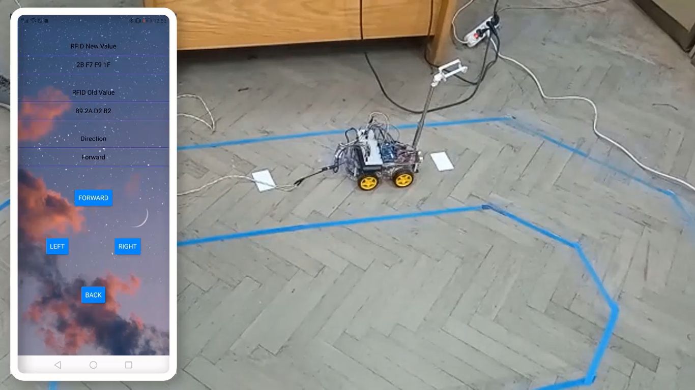
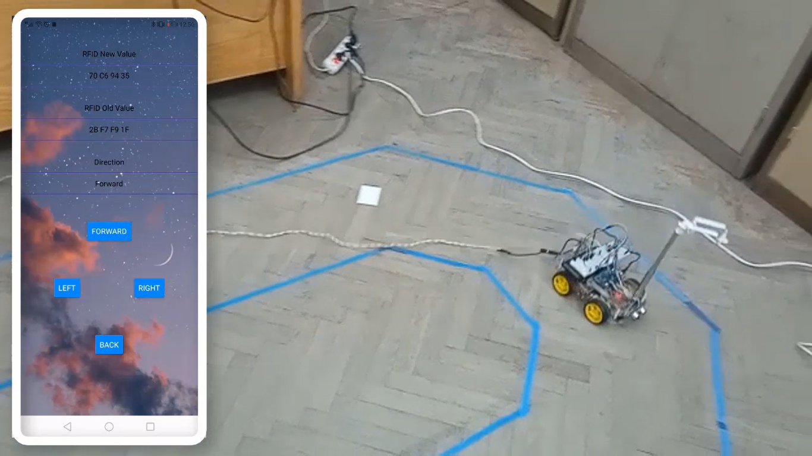
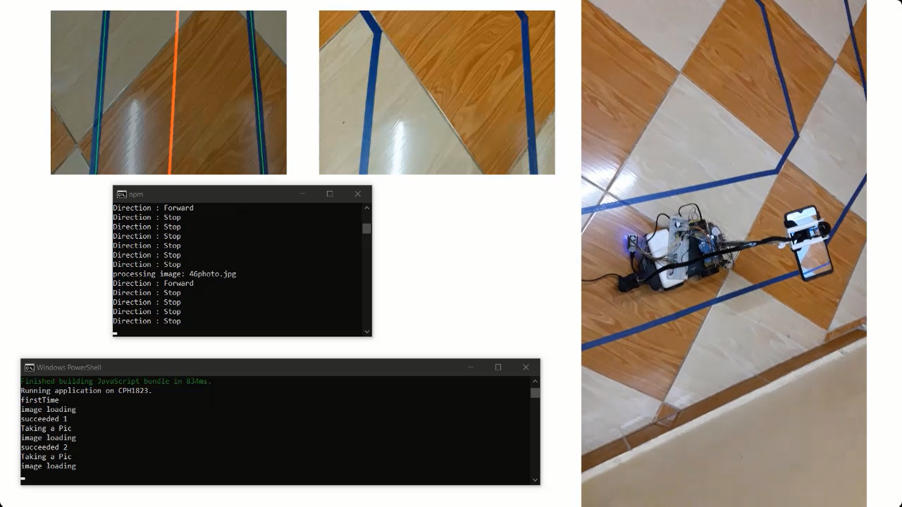
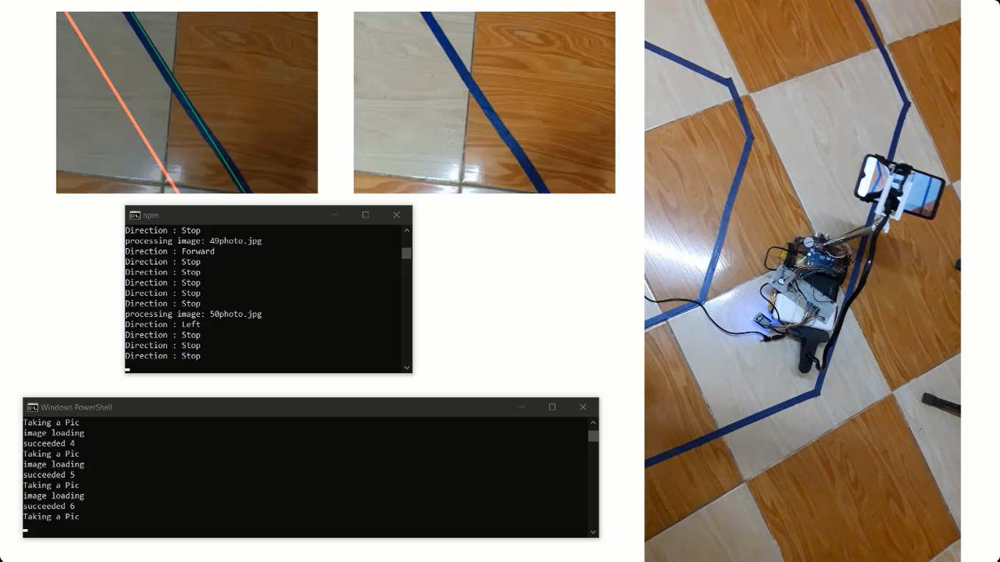

# Self-Driving-Car

Since AI and Computer Vision emerged, one of the most projects that we tried to achieve was the self-driving car.
Engineers world wide always worked on building an algorithm to allow the software to make decisions on its own based on the data given to it.

Here, we built a model of a car (body, tires and motors), connected it to an Esp module to allow it to send and receive data. Then we designed two different Modes to the car to which it would operate on:

* Manual Control.
* Autonomus Control.

### Manual Control

To give the user full control on the car, we developed a mobile app that looks like a joystick controller, and we connected the motors of the car to the circuit that is operated by the Esp, we then hinged the Esp to our server through WiFi, and allowed orders of the users to be sent to the server through the app where it's then routed to the cars through the Esp and hence operates the motors.





### Autonomus Control

To capture the road in front of the car, we developed another feature to our mobile app to access the phone's camera and capture photos every couple seconds and upload them to the server to be processed.
At the server, we designed an algorithm based on computer Vision libraries where the photo is analyzed and the algorithm detects the lane sides and their angle proportional to the main perpendicular line, And hence decide whether the road is continuing to be straight or it rotates to the left or right and steer the car according to the decision by sending order back through the server to the Esp.





```

For more Info Check our videos in the Results folder.

```
